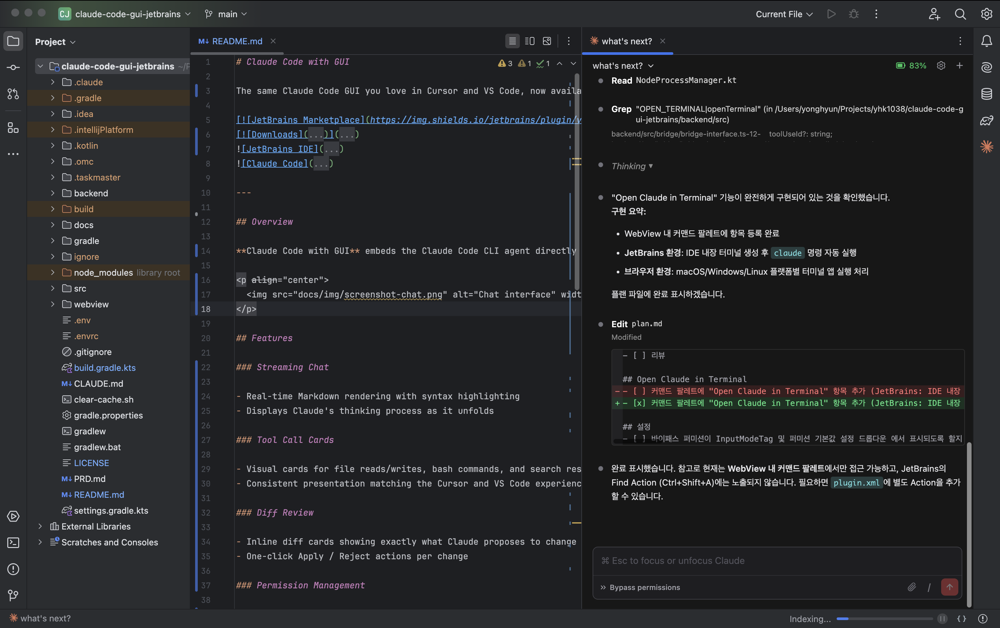
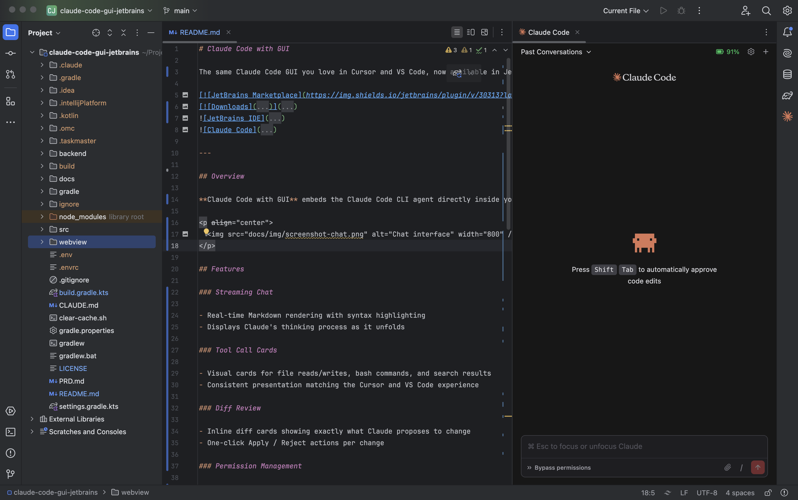
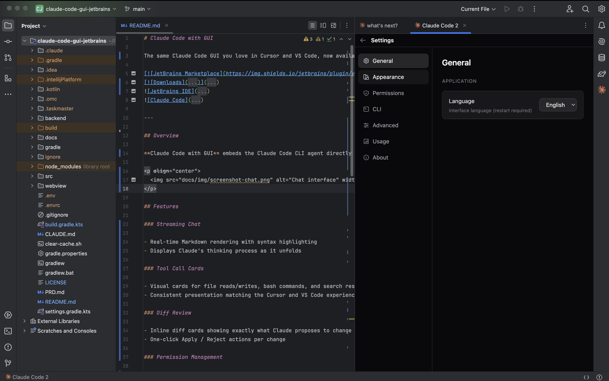

# Claude Code with GUI

The same Claude Code GUI you love in Cursor and VS Code, now available in JetBrains IDEs.

---

## Overview

**Claude Code with GUI** embeds the Claude Code CLI agent directly inside your JetBrains IDE as a first-class GUI panel. Unlike terminal-only solutions, it brings the full visual experience — streaming responses, tool call cards, inline diff review, and permission dialogs — directly into the editor you already use. Designed to match the interaction patterns and look-and-feel of the Claude Code extension in Cursor and VS Code, it works across all JetBrains IDEs including IntelliJ IDEA, PyCharm, WebStorm, GoLand, Rider, and CLion.

  

## Features

### Streaming Chat

- Real-time Markdown rendering with syntax highlighting
- Displays Claude's thinking process as it unfolds

### Tool Call Cards

- Visual cards for file reads/writes, bash commands, and search results
- Consistent presentation matching the Cursor and VS Code experience

### Diff Review

- Inline diff cards showing exactly what Claude proposes to change
- One-click Apply / Reject actions per change

### Permission Management

- Native dialogs for file and bash operation permissions
- Flexible permission policy configuration in settings

### Multiple Sessions

- Manage multiple conversations simultaneously with tab support
- Session dropdown for fast switching between active sessions
- Browse full session history

### Settings

- Configure CLI path, theme, font size, permission policy, and log level

More screenshots

| Welcome screen | Settings panel |
|---|---|
|  |  |

## Requirements

- JetBrains IDE 2024.2 — 2025.3
- Claude Code CLI >= 1.0.0, installed and authenticated
- Node.js >= 18

## Quick Start

1. Verify `claude` CLI is installed and authenticated (`claude --version`).
2. Install the plugin from the JetBrains Marketplace.
3. Open the panel via **Tools > Open Claude Code** or press `Ctrl+Shift+C`.
4. Start coding with Claude.

| Action | Shortcut |
|---|---|
| Open Claude Code panel | `Ctrl+Shift+C` |
| New session tab | `Cmd+N` / `Ctrl+N` (panel focused) |

---

## Changelog

### v0.8.1

- Fixed `cliPath` setting being ignored during CLI spawn
- Hardened HTTP listener security

See [CHANGELOG.md](CHANGELOG.md) for full version history.

## Contributing

Contributions are welcome. Please open an issue first to discuss larger changes.

## License

This project is licensed under the [GNU Affero General Public License v3.0](LICENSE).
