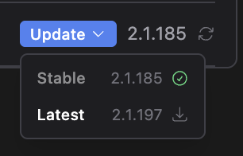
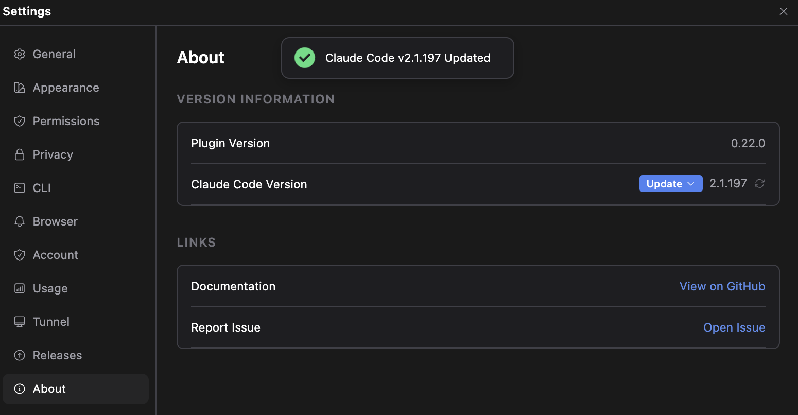
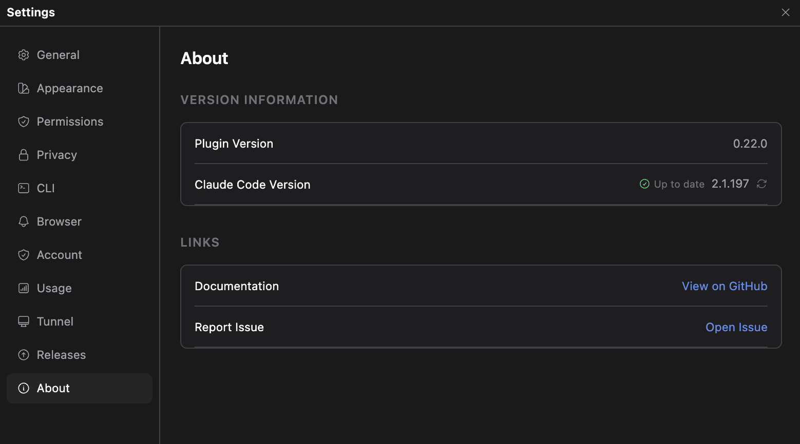

# Claude Code CLI 버전 확인 및 업데이트

> 언어: [English](./en.md) · **한국어**
>
> 관련: [PR #150](https://github.com/yhk1038/claude-code-gui-jetbrains/pull/150)

## 새로운 기능

이제 Claude Code with GUI에서 **설치된 Claude Code CLI 버전**을 확인하고, **설정 → About에서 바로 업데이트**할 수 있습니다. 터미널로 나갈 필요가 없습니다.

핵심은, **설치한 방식 그대로** 업데이트한다는 점입니다. volta로 설치했으면 `volta install`, npm이면 `npm install -g`, 네이티브 설치면 `claude update`, Homebrew·WinGet이면 각자의 업그레이드 명령을 실행합니다. 그래서 **실제로 실행 중인 CLI가 그 자리에서 갱신**되며, 엉뚱한 패키지 매니저로 사본을 하나 더 까는 일이 없습니다.

## 어디에 있나요

- **설정 → About → Claude Code Version** — 현재 버전을 표시하고, 더 최신 버전이 있으면 왼쪽에 **Update** 컨트롤이 나타납니다.
- **슬래시 커맨드 패널 하단** — `Claude Code <버전>` 텍스트를 클릭하면 버전을 다시 조회합니다(About의 새로고침 버튼과 동일). 그 옆의 플러그인 버전은 무관하므로 일반 텍스트로 둡니다.

## 업데이트하기

더 최신 버전이 있으면 버전 옆에 **Update** 컨트롤이 나타납니다.

모양은 설치 방식에 따라 달라집니다:

- **npm / pnpm / yarn / volta** → 채널을 고르는 **드롭다운**:
  - **Stable** — 약 일주일 정도 뒤처지며, 큰 회귀가 있는 릴리스는 건너뜁니다.
  - **Latest** — 최신 릴리스.
  - 각 항목은 대상 버전과 아이콘을 보여줍니다: 업그레이드면 **다운로드** 아이콘, 다운그레이드면 **되돌리기(undo)** 아이콘, 이미 설치된 버전이면 **초록 체크**(이 항목은 클릭되지 않습니다).
- **네이티브 설치 / Homebrew / WinGet** → 채널의 최신으로 올려주는 단일 **Update** 버튼(이 방식들은 특정 버전 지정을 받지 않습니다).

실행 전에 확인 창이 뜹니다 — **업데이트는 CLI를 교체하므로 진행 중인 Claude 세션이 중단될 수 있습니다.** 실행하는 동안에는 컨트롤에 스피너가 돕니다. 성공하면 토스트가 뜨고 표시된 버전이 자동으로 갱신됩니다.

최신 릴리스에 도달하면 버튼 대신 **Up to date** 표시가 나타납니다.

## Update 버튼이 없을 때

CLI가 **안전한 비대화형 업데이트 경로가 없는** 방식으로 설치된 경우 — 리눅스 시스템 패키지 매니저(`apt`/`dnf`/`apk`, `sudo` 필요)나, 알려진 설치기로 특정할 수 없는 위치 — **Update 컨트롤을 표시하지 않습니다.** 이는 의도된 동작으로, 잘못된 명령을 실행해 사본 설치를 남기느니 아무것도 안 보이는 편이 안전하기 때문입니다. 이런 경우는 설치한 방식대로 업데이트하세요.

## 버전은 어떻게 확인하나요

사용 가능한 버전은 **npm 레지스트리**(`npm view @anthropic-ai/claude-code dist-tags`)에서 가져옵니다. 설치 방식과 무관하게 stable/latest 릴리스 번호의 표준 출처입니다. 이 조회는 About을 열 때 조용히 실행되고, 현재 버전은 `claude --version`으로 확인합니다.

## 참고

- macOS, Linux, WSL, Windows에서 동작하며, 플러그인이 이미 CLI를 실행할 때 쓰는 명령 해석 방식을 그대로 사용합니다.
- 버전은 앱 전체에서 공유되는 단일 값이라, 한 곳에서 새로고침하면 모든 곳에 반영됩니다.
