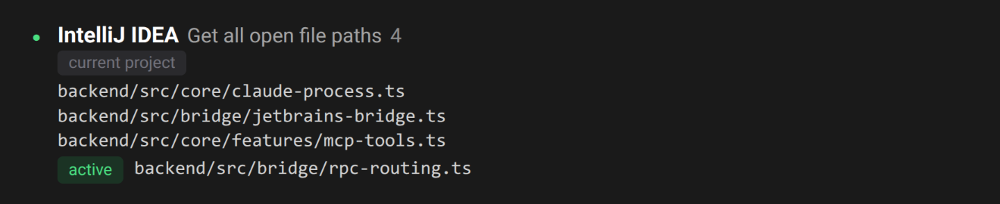
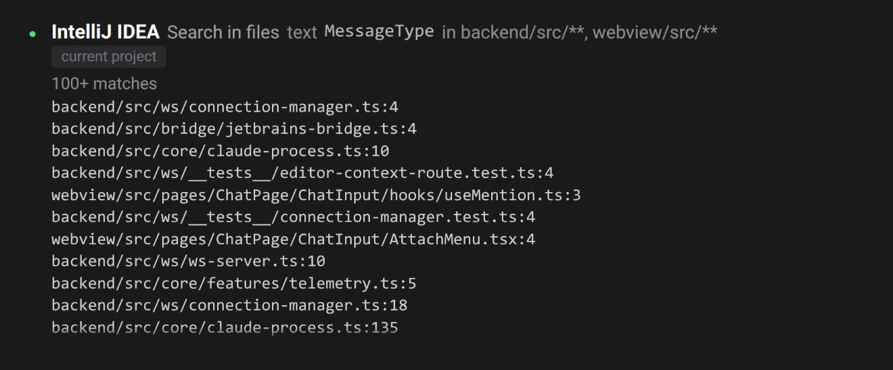
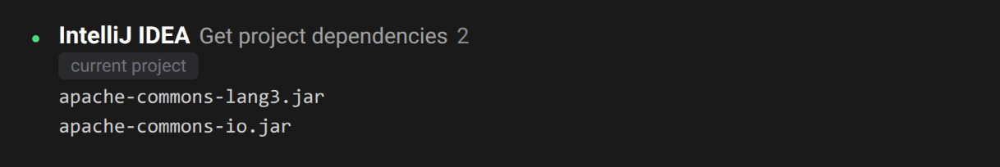
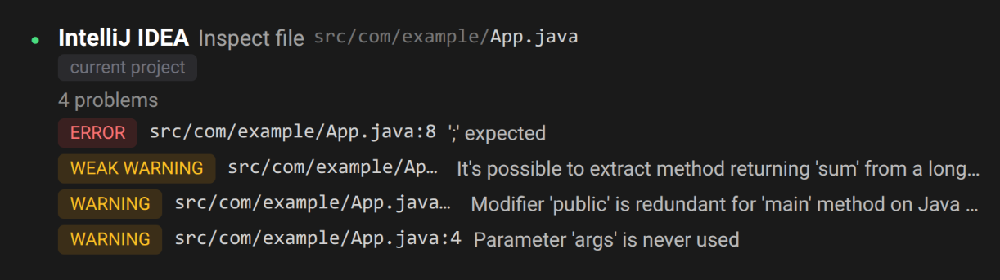
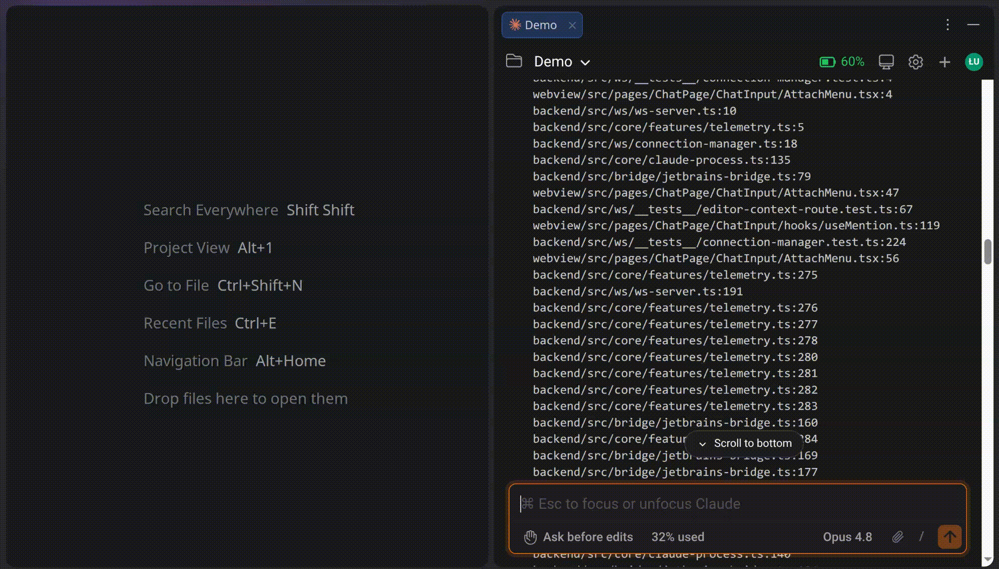
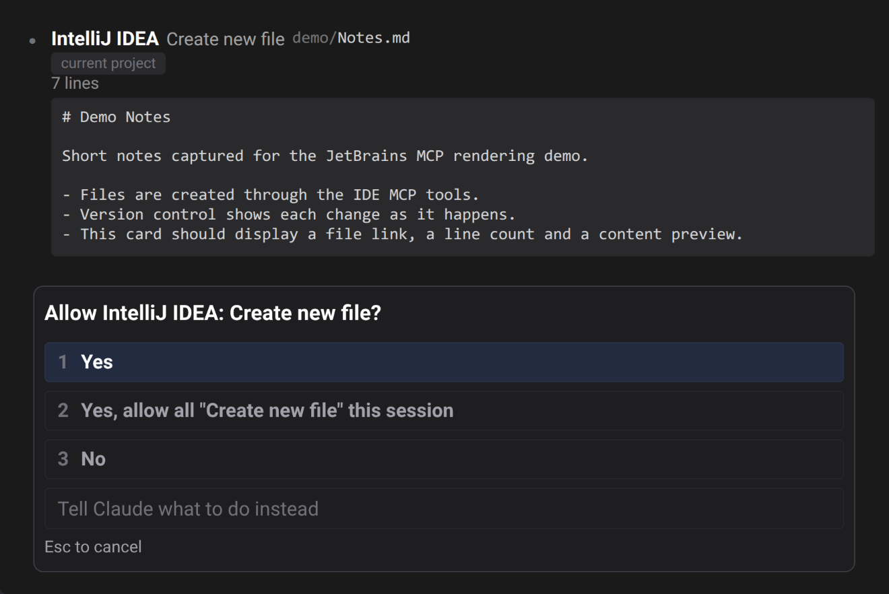
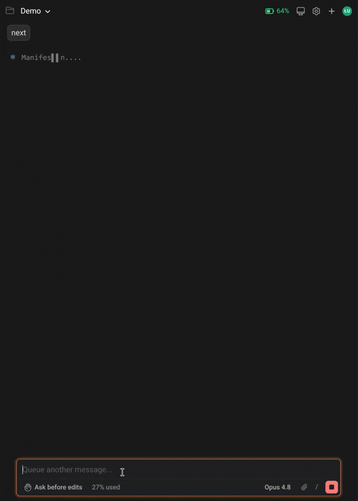
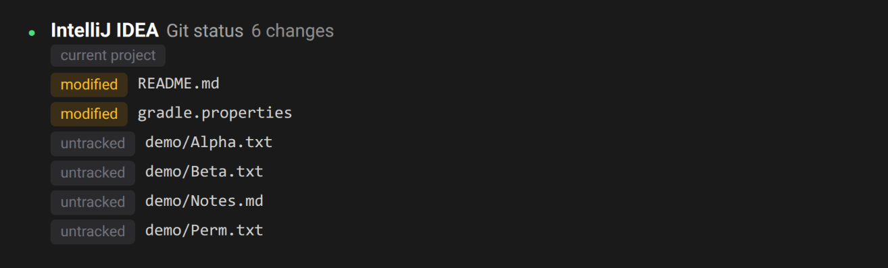
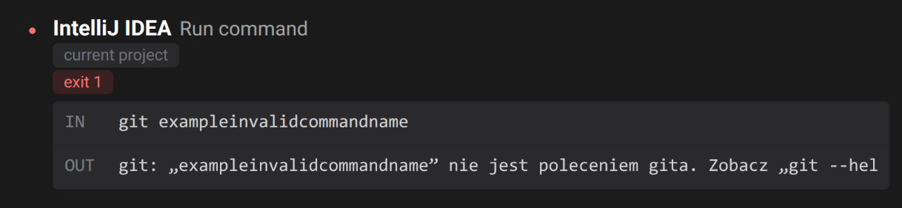

# Native rendering for JetBrains IDE MCP tools

> Languages: **English** · [한국어](./ko.md)
>
> Related: [PR #147](https://github.com/yhk1038/claude-code-gui-jetbrains/pull/147) · [#41](https://github.com/yhk1038/claude-code-gui-jetbrains/issues/41)

## What's new

JetBrains IDEs (2025.2+) ship a **built-in MCP server**, and Claude Code auto-registers its tools under the IDE's launcher name (`mcp__idea__…`, `mcp__pycharm__…`, `mcp__webstorm__…`, and so on). Until now those calls fell through to the generic MCP renderer and showed up as raw JSON.

They now render as **first-class, native-looking chat cards** — on par with the built-in `Bash` / `Edit` / `Read` cards — with a **humanized permission dialog**. When Claude drives your IDE's own tools, you get IDE-quality UI right in the chat.

Everything here is driven purely by the public tool contract (tool name, input schema, JSON result) — the same surface a `claude …` CLI user sees. There is no dependency on an official SDK or any undocumented protocol.

## Rich per-tool cards

Every JetBrains tool family gets a dedicated card — files/editor, code/symbols, inspections, run/debug, terminal, VCS, and database. Each card shows the real target of the call in a compact, readable form instead of a JSON blob.

## `file:line` links open in the IDE

Result rows are clickable `path` (or `path:line`) links. Clicking one opens the file **at that line** in the IDE.

## Humanized permission dialog

When a tool needs approval, the prompt reads like plain language — **"Allow IntelliJ IDEA: Create new file?"** — instead of `Allow mcp__idea__create_new_file?`. The "allow all for this session" option is humanized the same way.

## Denied = a neutral decision, not an error

If you deny a tool, the card renders it as a muted **"declined"** note — never a red error — because a denial is your decision, not a tool failure. The distinction survives a reload of the session.

## Project confirmation chip

Every card confirms **which project** the tool acts on. When it's your current session project, a compact **"current project"** chip is shown (full path on hover). When it targets a different project — or none was specified — the card shows a yellow **"different project"** warning with the full path, so a tool can't silently act on the wrong project.

## Truthful status dots

A card turns **red on a real payload-level failure** — a build that didn't compile (`isSuccess:false`), a command with a non-zero exit code, or a breakpoint that wasn't applied — not just on transport errors. So the status dot tells you the truth about what happened.

## `apply_patch` diffs and more

`apply_patch` renders a full per-file diff, and the input is fully disclosed so nothing a tool was asked to do is hidden from the approval.

## Works across every JetBrains IDE

The same renderers are bound for `idea` / `pycharm` / `webstorm` / `goland` / `phpstorm` / `rubymine` / … — the tool set is the same across IDEs, so the cards look and behave the same wherever you use them.

Newer IDE builds also ship newer names for some of the same operations (e.g. `search_in_files_by_text`, `find_files_by_glob`, `get_file_text_by_path`, `replace_text_in_file`); these are covered too, so the rich cards keep appearing on current IDE versions.

## Notes

- **Turning it on:** the IDE's built-in MCP server isn't wired into Claude Code out of the box yet — you generally have to ask Claude to use the IDE's tools (e.g. "search the project with the JetBrains tools"). Native `/ide` integration is tracked in [#41](https://github.com/yhk1038/claude-code-gui-jetbrains/issues/41).
- **Debugger tools** (the `xdebug_…` family) are available only with **IntelliJ IDEA Ultimate**.
- Any IDE tool that doesn't have a dedicated card yet falls back to a **branded generic** card, so it still reads as a JetBrains tool.
