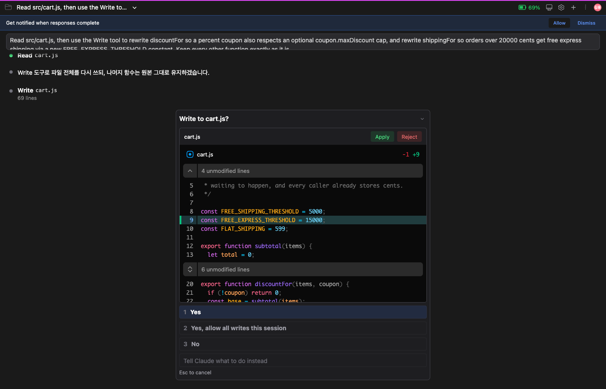
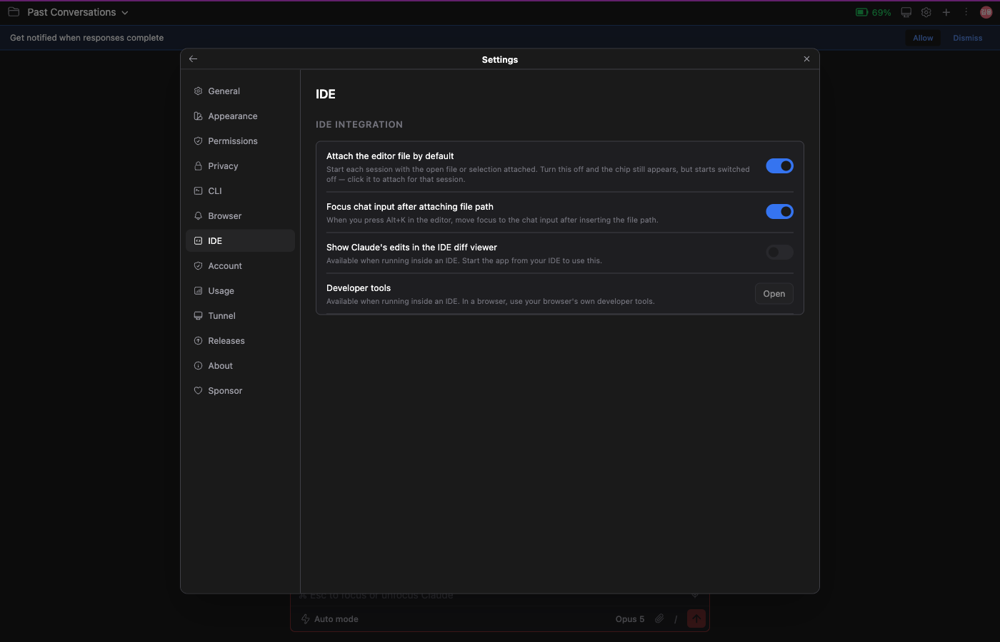

# Fix the proposed code where you are reading it

Sometimes Claude proposes an edit that is right except for one thing. A
constant is a bit too large, or a name does not match how you write them here.

Until now you had to explain that. "Good, but make it 15000 instead of 20000" —
a whole extra turn for a change too small to be worth describing.

From this release you can **edit the proposed side in place**, and what you
typed is what gets written.

## In the IDE

When Claude asks to edit a file, type into the **Proposed** side of the diff
window that opens.

It is your editor, so completion, bracket matching, `Cmd+Z` and your keymap all
work the way they do when you write code normally. There is no new editor to
learn.

The **Original** side stays read-only. That side is the file as it is on disk,
where typing would change nothing while looking like it had.

**Apply** writes what is on screen. Touch nothing and it behaves exactly as it
did before: Claude's proposal goes through as written.

**Reject** discards your edits along with the change. Refusing an edit means
"do not write this", not "write something else instead".

The tick boxes for keeping part of a change ([#109](https://github.com/Swttch/swttch/issues/109))
still work. Untick to narrow what you are keeping, then edit what is left.

## And in a browser

Before this release, running outside an IDE meant the approval prompt could name
the file but **not show what was in it** — there was no IDE window to open one
in. You approved or rejected a change you could not see.

Now the diff is drawn right there.

*The proposed `20000` edited down to `15000` in place. Apply writes the screen
exactly as it stands.*

Syntax highlighting, collapsed unchanged regions and **editing** all work as
they do in the IDE. Narrow windows show one column; wide ones show the two sides
next to each other.

## Prefer this screen inside the IDE too?

Turn off **Settings → IDE → Show Claude's edits in the IDE diff viewer**.

That setting used to decide whether you saw a diff at all. Now it decides
**where** you see one: on, in the IDE's diff tab; off, in the chat. Either way
the change is never hidden.

*Outside an IDE the row is disabled — there is no IDE window to open, so the
in-chat diff is the only route.*

## Worth knowing

**Your edit reaches Claude too.** The conversation continues from what was
actually written, not from what was proposed.

**Undo everything and Apply**, and Claude's original call goes through
untouched. Typing and then pressing `Cmd+Z` lands here.

**Edit the proposal until it matches the file exactly**, and Apply is treated as
a refusal. There would be nothing to write, and reporting success for an edit
that never happened would be worse than saying no.

Related: [#305](https://github.com/Swttch/swttch/issues/305), [#109](https://github.com/Swttch/swttch/issues/109)
